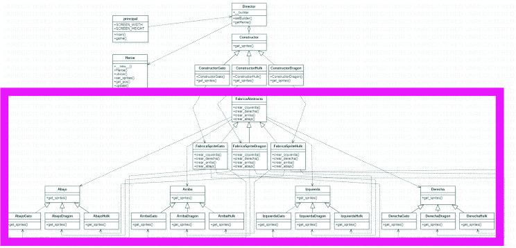

### Pre-requisitos 📋

_Este programa se realizó con Pygame en Python. Pygame requiere Python; Si aún no lo tiene, puede descargarlo de python.org. Use python 3.7.7 o superior, porque es mucho más amigable para los novatos y, además, se ejecuta más rápido._


### Instalación 🔧

_La mejor manera de instalar pygame es con la herramienta pip (que es lo que python usa para instalar paquetes). Tenga en cuenta que esto viene con python en versiones recientes. Usamos el indicador ``` --user ``` para indicarle que se instale en el directorio de inicio, en lugar de hacerlo globalmente._

```
python3 -m pip install -U pygame --user
```
Para ver si funciona, ejecute uno de los ejemplos incluidos:

python3 -m pygame.examples.aliens
Si funciona, ¡estás listo para comenzar! Si no, hay instrucciones más detalladas y específicas de la plataforma más abajo en la página._

## Patrones de Diseño ⚙️

### Patrones de creación

Los patrones de creación abstraen la forma en la que se crean los objetos, permitiendo tratar las clases a crear de forma genérica dejando para más tarde la decisión de qué clases crear o cómo crearlas.

- **Abstract Factory:** Proporciona una interfaz para crear familias de objetos o que dependen entre sí, sin especificar sus clases concretas.



- **Builder:** Separa la construcción de un objeto complejo de su representación, de forma que el mismo proceso de construcción pueda crear diferentes representaciones.

## Autores ✒️

_Este trabajo fue realizado por:_

* **Daniel Arenas** 
* **Lorena Damián** 
